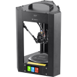
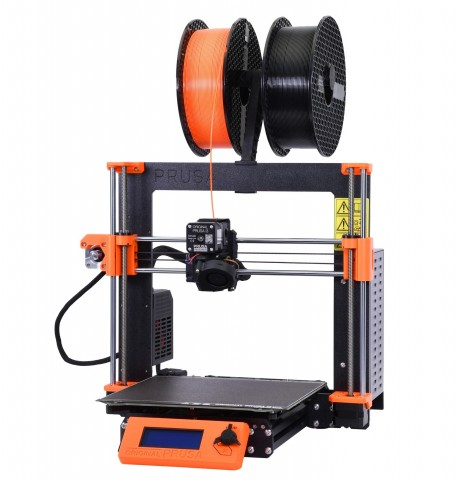

# 3DPrinterConfig
My 3D Printers Configuration backup:

## Printer List:
MPMD | Pruscilla
--------|------
 | 
Monoprice MiniDelta 2019 | Prusa i3 MK3S (partial MK3S+ conversion) with MMU2S
[MPMD Wiki](https://mpminidelta.com/) | [Prusa](https://prusa3d.com)

Using the following firmware:

Firmware|Logo  |Example Boards
--------|------|--------------
[[Klipper]](https://www.klipper3d.org/) | 
[[Marlin]](https://marlinfw.org/) | 
[[PrusaMarlin]](https://github.com/prusa3d/Prusa-Firmware) | 

## Guide

This firmware repo is based loosely on [willngton/3DPrinterConfig](https://github.com/willngton/3DPrinterConfig).
