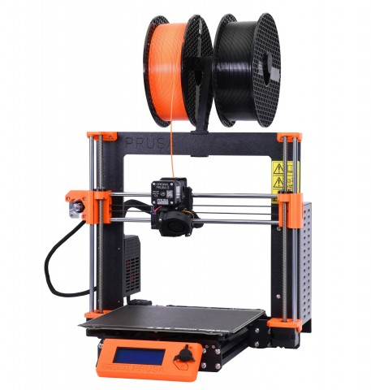

# Pruscilla

Pruscilla i3 MK3S
<br />
<br />

## Modifications

* MK3S+ hotend
* "Custom" fried fan port on Einsy
* MMU2S
* PrintedSolid Enclosure
* Pi4 with TFT and Octoprint/Octodash

# Guides

## Prusa Firmware with Pin Remap

I keep somehow frying the hotend thermistor port on multiple Einsy rambo boards. There's a way to remap to an unused port by custom compiling your own firmware.

### Requirements:

* Debian/Ubuntu Linux x86_64. Doesn't work on MacOS, doesn't work on Raspbian

* Ubuntu VM (I use the one on my main workstation, Obelisk)

* Check out [firmware] repository.


### Build

#### Step 1 - checkout/update source
*NOTE* You might need to `git clean -dxf` an existing checkout in order to get the build to work right.

#### Step 2 - Apply diff
Apply the following diff, swapping TEMP_0_PIN and TEMP_1_PIN. TEMP_0_PIN should be 0, while TEMP_1_PIN should be 1.

```
geoff@obelisk-ubuntu:~/src/Prusa-Firmware$ git diff
diff --git a/Firmware/pins_Einsy_1_0.h b/Firmware/pins_Einsy_1_0.h
index b3841a59..74de5ea9 100755
--- a/Firmware/pins_Einsy_1_0.h
+++ b/Firmware/pins_Einsy_1_0.h
@@ -59,10 +59,12 @@
 #define TEMP_BED_PIN         2 //A2
 
 #define HEATER_0_PIN         3 //PE5
-#define TEMP_0_PIN           0 //A0
+//#define TEMP_0_PIN           0 //A0
+#define TEMP_0_PIN           1 //A1 as A0 is fried
 
 #define HEATER_1_PIN        -1
-#define TEMP_1_PIN           1 //A1
+//#define TEMP_1_PIN           1 //A1
+#define TEMP_1_PIN           0 //A0 (this pin is unused)
 
 #define HEATER_2_PIN        -1
 #define TEMP_2_PIN          -1
```

#### Step 3
Run `./build.sh`

Resulting bin file is in `lang/firmware.hex`

[firmware]: https://github.com/prusa3d/Prusa-Firmware.git