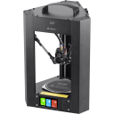

## MPMD

Monoprice MiniDelta v1 2019-era with the higher resolution stepper motors.
Converted to an SKR Pico 1.0 with a RPi Zero W
 
 

### Modifications

* Binder Clip Bed Mod
* Wham-Bam Flex Build plate
* Crap catchers on towers
* Stiffer spring rate extruder
* Klipper Firmware
* V6 Clone nozzle with custom effector
* SKR Pico 1.0 Main board
* Bigtreetech TFT35 control panel (WIP, no heades on the Pico)

### Notes

I could not get the stock optical end-stops to work at all. I may have nuked them by sending them 5V instead of 3.3 v.

Using the TMC2209 virtual endstops with the printed endstop replacements from https://www.prusaprinters.org/prints/113166-mpmd-frame-mods
