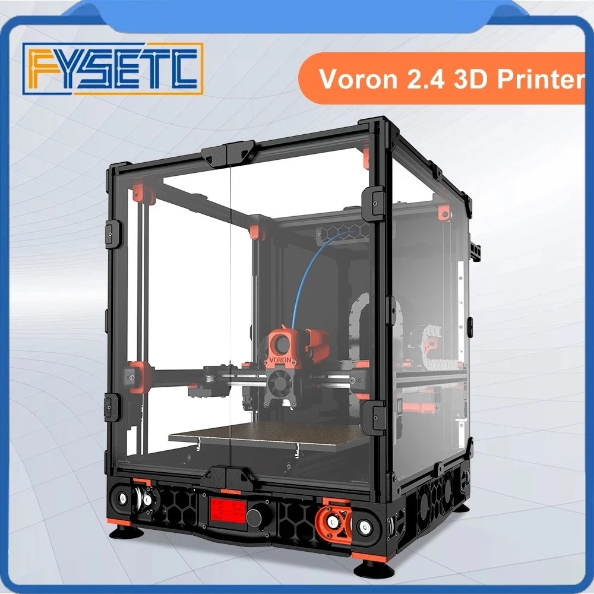
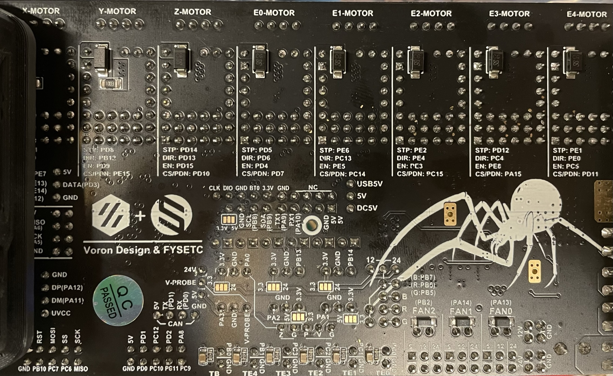

## voronica

FYSETC Voron 2.4 Kit with 2.4R2 mods applied. Revo Six hotend.
 
 

### Modifications

E3D Revo V6

### Notes

Still being built. Parts all printed on Pruscilla.

* [Klipper Spider Config](https://github.com/VoronDesign/Voron-2/blob/Voron2.4/firmware/klipper_configurations/Spider/Voron2_Spider_Config.cfg)
* [Klipper Install and Update Helper](https://github.com/th33xitus/kiauh)
* [FYSETC Voron 2 Repo](https://github.com/FYSETC/FYSETC-Voron-2)
* [FYSETC Kit BOM](https://github.com/FYSETC/FYSETC-Voron-2/blob/main/BOM.md)
* [FYSETC Spider Pinout](https://github.com/FYSETC/FYSETC-SPIDER/blob/main/Spider_V2.2_Pinout.pdf)
* [Voron Sourcing Guide](https://vorondesign.com/sourcing_guide?model=V2.4)

### Mainboard

### Mainboard

