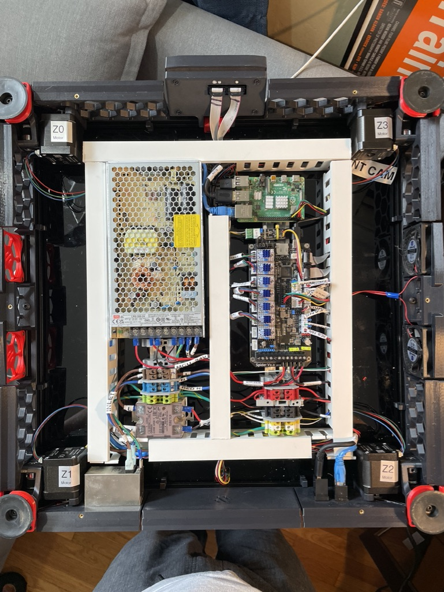

# voronica v2.4659


FYSETC Voron 2.4 Kit with 2.4R2 mods applied. Slice Mosquito Magnum hotend, option to switch to Revo. SB2040 CAN bus toolhead

## Modifications

* Slice Mosquito Magnum with Bondtech CHT nozzles
* Alternate - E3D Revo V6 option
* Mellow RP2040 CAN bus toolhead
* [FYSETC CAN-bus Expander for Spider.](https://www.fysetc.com/products/fysetc-canbus-expander-module-for-spider-board)
* Finger ducting in wiring bay [similar to LDO kit](https://docs.ldomotors.com/en/voron/voron2/wiring_guide_rev_c)
* Parts-binned filtered AC inlet - Interpower 83510031. I designed a [custom skirt to hold it](STL/Voron%20Power%20Inlet%20-%20Interpower%20Filtered/README.md).

## Notes

Parts all printed on Pruscilla.

* [Klipper Spider Config](https://github.com/VoronDesign/Voron-2/blob/Voron2.4/firmware/klipper_configurations/Spider/Voron2_Spider_Config.cfg)
* [Klipper Install and Update Helper](https://github.com/th33xitus/kiauh)
* [FYSETC Voron 2 Repo](https://github.com/FYSETC/FYSETC-Voron-2)
* [FYSETC Kit BOM](https://github.com/FYSETC/FYSETC-Voron-2/blob/main/BOM.md)
* [FYSETC Spider Pinout](https://github.com/FYSETC/FYSETC-SPIDER/blob/main/Spider_V2.2_Pinout.pdf)
* [Voron Sourcing Guide](https://vorondesign.com/sourcing_guide?model=V2.4)
* [Mellow SB2040 install](https://www.teamfdm.com/forums/topic/851-install-canboot-on-sb2040/#comment-5785)

## Electronics Bay

Here's the electronics bay as of October of 2023.



### Mainboard

FYSETC Spider 2.2

Rear view of the Spider board showing the pin mapping to the MCU:


There's a [mapping file of pins to symbolic names](klipper/spider_aliases.cfg) in the klipper configuration.

## Operations

### Klipper firmware updates

One of the annoying things about Klipper is that updating the MCUs isn't an easy task. Each MCU has to be compiled individually, and this can clobber your firmware configuration files if you're not careful.

In the klipper-build directory, I keep some of the menuconfig output for the various MCUs.

#### Spider

Board must be in DFU in order to flash.

1. `sudo service klipper stop`
1. Install jumper between BT0 and 3.3V
1. Press reset button on right hand side by Pi
1. Verify the spider shows up in `lsusb` output. Should be something like:

    ```none
    ~/klipper  ‹master*› $ lsusb | grep DFU
    Bus 001 Device 005: ID 0483:df11 STMicroelectronics STM Device in DFU Mode
    ```

1. Perform the build and flash.

    ```bash
    cd ~/klipper
    FLASH_DEVICE="0483:df11"
    KCONFIG_DIR="${HOME}/printer_data/config/klipper-build"
    _kc="${KCONFIG_DIR}/config.spider"
    make clean KCONFIG_CONFIG="${_kc}"
    make menuconfig KCONFIG_CONFIG="${_kc}"
    make -j4 KCONFIG_CONFIG="${_kc}"
    make flash FLASH_DEVICE="${FLASH_DEVICE}" KCONFIG_CONFIG="${_kc}"
    ```

    a. If the settings get clobbered, use:

      * Enable extra low-level configuration options
      * Microcontroller Arch STMicroelectronics STM32
      * Processor model STM32F446
      * Bootloader offset 32KiB bootloader
      * Clock Reference 12 MHz crystal
      * Communication interface USB to CAN bus bridge (USB on PA11/PA12)
      * CAN bus interface (CAN bus (on PD0/PD1))
      * CAN bus speed 1000000 (1Mbit, defaults to 500000)

1. Remove jumper
1. Press reset button
1. Verify board shows up in `lsusb` output again

    ```none
    ~/klipper  ‹master*› $ lsusb | grep CAN
    Bus 001 Device 008: ID 1d50:606f OpenMoko, Inc. Geschwister Schneider CAN adapter
    ```

1. Start klipper
1. Get mad because CAN bus is screwey as usual, reboot host like three or four times until it stops complaining about the CAN bus being offline.

#### SB2040 Toolhead via CanBoot

This toolhead was originally configured using the CanBoot instructions from this document: [SB2040 and the curious case of disappearing firmware](https://docs.google.com/document/d/1yaRNuQxDxqgijE8YeJ2r9tUZgJZ4tXXjmrAiFyAfsek/edit)

Once installed, the CanBoot firmware rarely, if ever, needs to be updated again.

NOTE: to get the SB2040 into DFU mode, you need to stop klipper first, then power cycle the toolhead. The asiest way to do that at the moment is to pull the fuse in the underside electronics bay.

1. `sudo service klipper stop`
1. Power cycle toolhead by opening and closing the fuse panel on the bottom.
1. Find the CAN ID:

    ```bash
    cd ~/CanBoot
    ../klippy-env/bin/python ../klipper/scripts/canbus_query.py can0
    ```

    Should show something like:

    ```none
     ~/CanBoot/ [master] ../klippy-env/bin/python ../klipper/scripts/canbus_query.py can0
    Found canbus_uuid=f6f9ce8939ef, Application: Klipper
    Total 1 uuids found
    ```

1. Perform the build and flash.

    ```bash
    cd ~/klipper
    CANBUS_UUID=f6f9ce8939ef
    KCONFIG_DIR="${HOME}/printer_data/config/klipper-build"
    _kc="${KCONFIG_DIR}/config.sb2040-canboot"
    make clean KCONFIG_CONFIG="${_kc}"
    make menuconfig KCONFIG_CONFIG="${_kc}"
    make -j4 KCONFIG_CONFIG="${_kc}"
    ./lib/canboot/flash_can.py -u $CANBUS_UUID -v -f ./out/klipper.bin
    ```

    a. If the settings get clobbered, use:
      * Extra options
      * Microcontroller Arch Raspberry Pi RP2040
      * Bootloader offset 16KiB bootloader
      * Flash chip W25Q080 with CLKDIV 2
      * Communication interface CAN bus
      * CAN bus speed 1000000 (1Mbit, defaults to 500000)
      * GPIO pins to set at startup: gpio24

1. Start klipper and make sure that the system sees the MCU: `sudo service klipper start`

#### Raspberry Pi host

This MCU lets you trigger relays and other GPIOs. I'm not currently using any of that functionality, but I am using it for the host load average calculations and other side benefits.

1. Stop klipper `sudo service klipper stop`
1. Perform the build and flash.

    ```bash
    cd ~/klipper
    KCONFIG_DIR="${HOME}/printer_data/config/klipper-build"
    _kc="${KCONFIG_DIR}/config.rpi"
    make clean KCONFIG_CONFIG="${_kc}"
    make menuconfig KCONFIG_CONFIG="${_kc}"
    make -j4 KCONFIG_CONFIG="${_kc}"
    make flash KCONFIG_CONFIG="${_kc}"
    ```

    a. If the settings get clobbered, use:

      * Microcontroller Arch Linux process

1. Start klipper `sudo service klipper start`