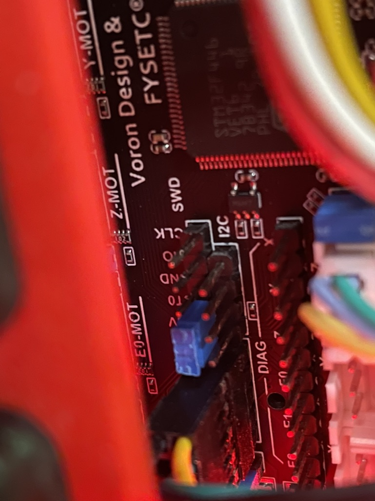
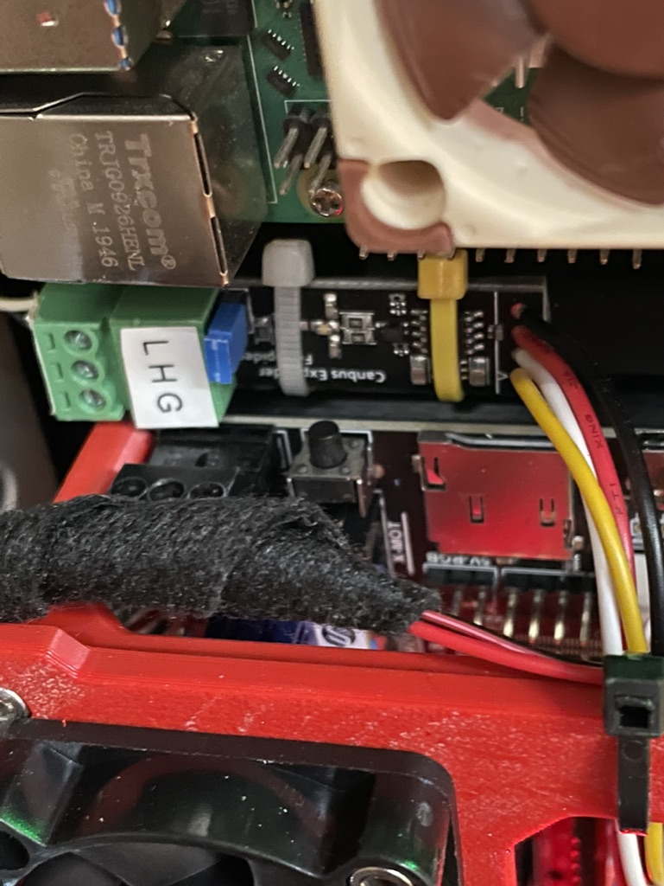
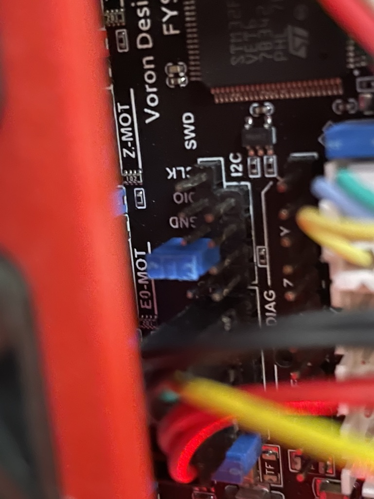
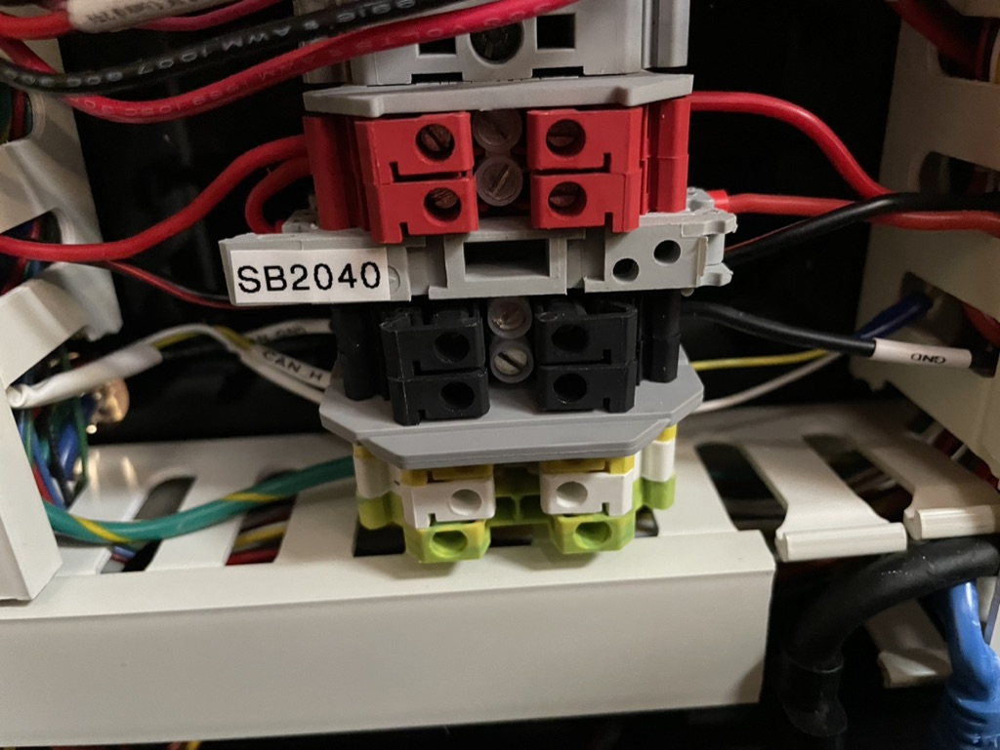
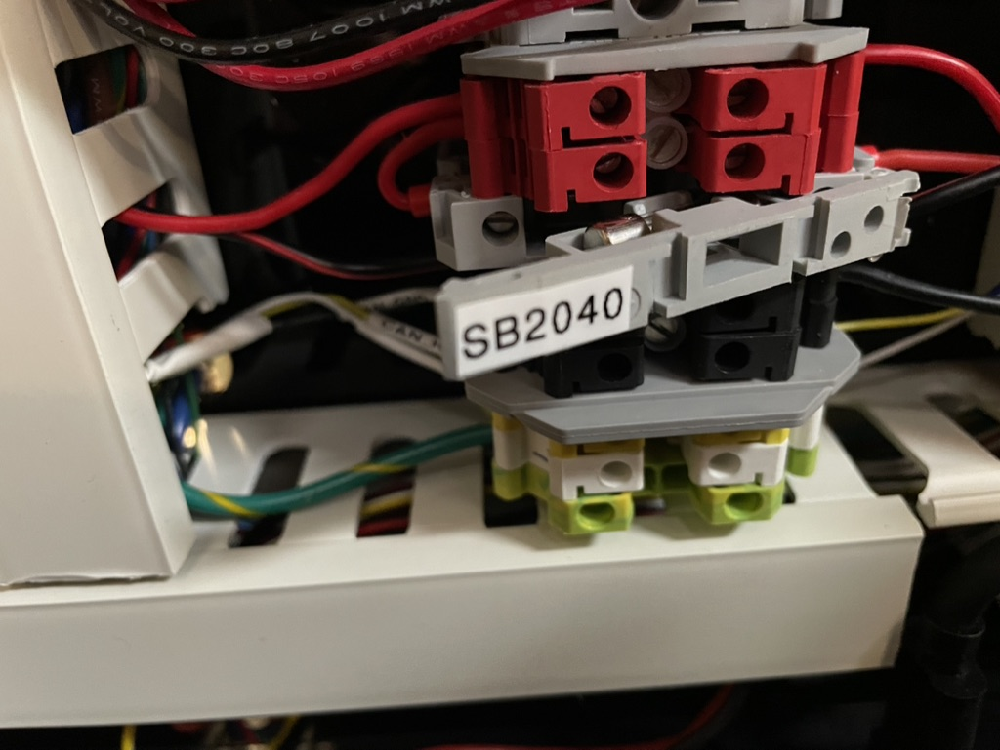

# Voronica Firmware Update Procedures

One of the annoying things about Klipper is that updating the MCUs isn't an easy task. Each MCU has to be compiled individually, and this can clobber your firmware configuration files if you're not careful.

In the klipper-build directory, I keep some of the menuconfig output for the various MCUs.

## Spider

Board must be in DFU in order to flash.

### Step one - stop klipper
1. `sudo service klipper stop`

### Step two - put Spider board in DFU mode

1. Install jumper between BT0 and 3.3V - USE PLASTIC TWEEZERS or power down printer, or be a hero and use long metal needlenose and try not to short anything.

1. Press reset button on right hand side by Pi (below white zip tie in below picture)

1. Verify the spider shows up in `lsusb` output. Should be something like:

    ```none
    ~/klipper  ‹master*› $ lsusb | grep DFU
    Bus 001 Device 005: ID 0483:df11 STMicroelectronics STM Device in DFU Mode
    ```

### Step three - build and flash klipper

1. Perform the build and flash.

    ```bash
    cd ~/klipper
    FLASH_DEVICE="0483:df11"
    KCONFIG_DIR="${HOME}/printer_data/config/klipper-build"
    _kc="${KCONFIG_DIR}/config.spider"
    make clean KCONFIG_CONFIG="${_kc}"
    make menuconfig KCONFIG_CONFIG="${_kc}"
    make -j4 KCONFIG_CONFIG="${_kc}"
    make flash FLASH_DEVICE="${FLASH_DEVICE}" KCONFIG_CONFIG="${_kc}"
    ```

    a. If the settings get clobbered, use:

      * Enable extra low-level configuration options
      * Microcontroller Arch: `STMicroelectronics STM32`
      * Processor model: `STM32F446`
      * Bootloader offset: `32KiB bootloader`
      * Clock Reference: `12 MHz crystal`
      * Communication interface: `USB to CAN bus bridge (USB on PA11/PA12)`
      * CAN bus interface: `CAN bus (on PD0/PD1)`
      * CAN bus speed 1000000 (1Mbit, defaults to 500000)
      * GPIO Pins to set at micro-controller startup: NONE (make sure it's empty)

### Step four - take board out of DFU mode

1. Remove jumper - USE PLASTIC TWEEZERS
Jumper in open position: 
1. Press reset button (below white zip tie in picture)

1. Verify board shows up in `lsusb` output again

    ```none
    ~/klipper  ‹master*› $ lsusb | grep CAN
    Bus 001 Device 008: ID 1d50:606f OpenMoko, Inc. Geschwister Schneider CAN adapter
    ```

### Step five - restart Klipper

1. Start klipper

NOTE: depending on the state of the USB to CAN adapter, the SB2040

## SB2040 Toolhead via CanBoot

This toolhead was originally configured using the CanBoot instructions from this document: [SB2040 and the curious case of disappearing firmware](https://docs.google.com/document/d/1yaRNuQxDxqgijE8YeJ2r9tUZgJZ4tXXjmrAiFyAfsek/edit)

Once installed, the CanBoot firmware rarely, if ever, needs to be updated again.

NOTE: to get the SB2040 into DFU mode, you need to stop klipper first, then power cycle the toolhead. The asiest way to do that at the moment is to pull the fuse in the underside electronics bay.

### Step One - stop klipper

1. `sudo service klipper stop`

### Step Two - get board into DFU mode

1. Power cycle toolhead by opening and closing the fuse panel on the bottom.
  Closed fuse: 
  Open fuse: 

### Step 3 - Build and Flash

1. Find the CAN ID:

    ```bash
    cd ~/CanBoot
    ../klippy-env/bin/python ../klipper/scripts/canbus_query.py can0
    ```

    Should show something like:

    ```none
     ~/CanBoot/ [master] ../klippy-env/bin/python ../klipper/scripts/canbus_query.py can0
    Found canbus_uuid=f6f9ce8939ef, Application: Klipper
    Total 1 uuids found
    ```
1. Perform the build and flash.

    ```bash
    cd ~/klipper
    CANBUS_UUID=f6f9ce8939ef
    KCONFIG_DIR="${HOME}/printer_data/config/klipper-build"
    _kc="${KCONFIG_DIR}/config.sb2040-canboot"
    make clean KCONFIG_CONFIG="${_kc}"
    make menuconfig KCONFIG_CONFIG="${_kc}"
    make -j4 KCONFIG_CONFIG="${_kc}"
    ./lib/canboot/flash_can.py -u $CANBUS_UUID -v -f ./out/klipper.bin
    ```

    a. If the settings get clobbered, use:
      * Extra options: enabled
      * Microcontroller Arch: `Raspberry Pi RP2040`
      * Bootloader offset: `16KiB bootloader`
      * Flash chip W25Q080 with CLKDIV 2
      * Communication interface `CAN bus`
      * CAN bus speed: `1000000` (1Mbit, defaults to 500000)
      * CAN RX gpio number: `4`
      * CAN TX gpio number: `5`
      * GPIO pins to set at startup: `gpio24`

### Step 4 - Restart Klipper
1. Start klipper and make sure that the system sees the MCU: `sudo service klipper start`

## Raspberry Pi host

This MCU lets you trigger relays and other GPIOs. I'm not currently using any of that functionality, but I am using it for the host load average calculations and other side benefits.

### Step 1 - Stop Klipper

1. Stop klipper `sudo service klipper stop`

### Step 2 - Build and flash
1. Perform the build and flash.

    ```bash
    cd ~/klipper
    KCONFIG_DIR="${HOME}/printer_data/config/klipper-build"
    _kc="${KCONFIG_DIR}/config.rpi"
    make clean KCONFIG_CONFIG="${_kc}"
    make menuconfig KCONFIG_CONFIG="${_kc}"
    make -j4 KCONFIG_CONFIG="${_kc}"
    make flash KCONFIG_CONFIG="${_kc}"
    ```

    a. If the settings get clobbered, use:

      * Microcontroller Arch Linux process

### Step 3 - Restart Klipper

1. Start klipper `sudo service klipper start`

## TinyFan

Extra fan controller - https://github.com/Gi7mo/TinyFan

### Step 1 - DFU Mode

1. Stop klipper `sudo service klipper stop`
1. Press boot and reset simultaneously on the tinyfan rp2040 daughterboard.
    You should now see the following in `lsusb` output:
    ```Bus 001 Device 018: ID 2e8a:0003 Raspberry Pi RP2 Boot```

### Step 2 Perform the build

    ```bash
    cd ~/klipper
    KCONFIG_DIR="${HOME}/printer_data/config/klipper-build"
    _kc="${KCONFIG_DIR}/config.tinyfan"
    make clean KCONFIG_CONFIG="${_kc}"
    make menuconfig KCONFIG_CONFIG="${_kc}"
    make -j4 KCONFIG_CONFIG="${_kc}"
    ```

    a. If the settings get clobbered, use:

      * Enable extra low-level configuration options
      * Micro-controller Architecture: `Raspberry Pi RP2040`
      * Flash chip: `GENERIC_03H with CLKDIV 4`
      * Communication interface: `USB`
      * USB ids: leave default
      * GPIO pins at startup: EMPTY

### Step 3 - flash the device

```bash
sudo mount /dev/sda1 /mnt && \
sudo cp out/klipper.uf2 /mnt && \
sudo umount /mnt
```

### Step 4 - Reset the board

Press the reset button on the daughterboard

Verify that you can now see in `lsusb`:

```
Bus 001 Device 020: ID 1d50:614e OpenMoko, Inc. rp2040
```

### Step 5 - Restart klipper

1. Start klipper `sudo service klipper start`

## TradRack SKR Mini E3 V2.0

This device has Katapult installed, because mini sd card firmware updates are for chumps.

Katapult instructions: [https://klipper.discourse.group/t/flashing-klipper-friendly-bootloader-on-btt-skr-mini-e3-v2/10977]

### Step 1 - Stop Klipper

### Step 2 - put board in USB bootloader mode

Double press the reset button on the mainboard.

### Step 3 - Compile Klipper

```bash
cd ~/klipper
KCONFIG_DIR="${HOME}/printer_data/config/klipper-build"
_kc="${KCONFIG_DIR}/config.tr"
make clean KCONFIG_CONFIG="${_kc}" && \
make menuconfig KCONFIG_CONFIG="${_kc}" && \
make -j4 KCONFIG_CONFIG="${_kc}"
```

If the settings get clobbered, use:

* **Enable** extra low-level configuration options
* Micro-controller Architecture: `STMicroelectronics STM32`
* Bootloader offset: `8KiB bootloader` - *NOTE this is different than the Voron default of `28KiB` due to `katapult` being in place!!*
* Clock reference: `8 MHz crystal`
* Communication interface: `USB (on PA11/PA12)`
* GPIO pins: `!PA14` - Don't forget to set this, the board won't boot otherwise

### Step 4 - flash the board

Note that the device must be in bootloader mode per Step 2.

1. Run the flash command:

  ```bash
  # Below command only worked the first time with the deployer.bin
  make flash \
    KCONFIG_CONFIG="${_kc}" \
    FLASH_DEVICE=/dev/ttyACM3
  #
  # --or--
  #
  # this worked with the double-press of the reset button
  make flash \
    KCONFIG_CONFIG="${_kc}" \
    FLASH_DEVICE=/dev/serial/by-id/usb-katapult_stm32f103xe_30FFDA054E4E353717730551-if00
  ```

### Step 5 - restart klipper

1. Reset the board to get it out of DFU.
1. Start klipper: `sudo service klipper start`
